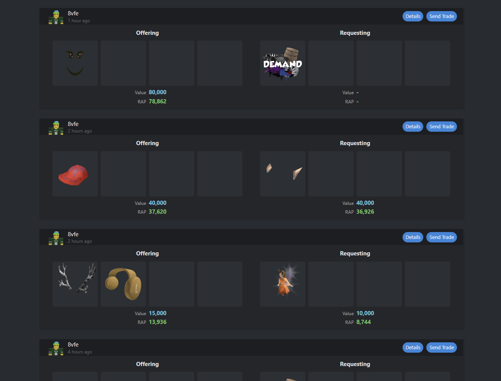

# Rolimons Calculator

A set of Python scripts that act as a Rolimons helper and Discord bot for calculating trade fairness and posting trade ads automatically.


## Summary
- Provides Discord slash commands to check trade value (`calculate`, `getinfo`).
- Can post trade advertisements to Rolimons programmatically (`posttradead`) and run an automated posting loop (`autopost.py`).

## Code  Layout
- `main.py` — Discord bot entrypoint with slash commands for calculating and posting trade ads.
- `autopost.py` — Variant that runs a background autopost loop; posts trade ads periodically to a channel.
- `rolimons.py` — Minimal Rolimons API helper: fetches item catalog, values, demand, and posts ads.
- `packages.txt` — List of Python dependencies.

## Requirements
- Python 3.10+ recommended
- Internet access (fetches Rolimons item API and posts to Rolimons)

## Install
Clone the repository and install dependencies:

```bash
git clone <repo-url>
cd RolimonsProject
pip install -r packages.txt
```

## Configuration
The project reads credentials from environment variables. Create a `.env` file or export these variables in your environment.

Required environment variables:

```env
DISCORD_TOKEN=<your_discord_bot_token>
ROLI_COOKIES=<your__RoliVerification_cookie_value>
```

Notes:
- The Discord guild id is currently hardcoded in `main.py` and `autopost.py` (1145805141291827272). Update if you want to use a different server.
- The bot expects users to have a role named `User` to run commands (see `required_role` in the scripts).

## Usage

Run the bot (connects to Discord and registers slash commands):

```bash
python main.py
```

Autopost runner (starts background posting loop via Discord command `posttradead` in `autopost.py`):

```bash
python autopost.py
```

Example slash command usages (Discord slash UI):
- `/calculate items_giving: 12345,67890 items_receiving: 13579` — compares values and returns advice.
- `/getinfo item_id: 12345` — returns name, value, demand and projection flag.
- `/posttradead items_giving: 1,2 items_receiving: 3 request_tags: upgrade player_id: 1304608425` — posts a trade ad using `ROLI_COOKIES`.

## Examples
- The `autopost.py` file contains a sample `trade_ads_g` and `trade_ads_r` dictionary used by the autoposter. Adjust these to change what it posts.

## Development
- Formatting: `black .` (optional)
- Linting: `flake8` (optional)
- Tests: none included. Add unit tests for `rolimons.py` helpers if desired.
